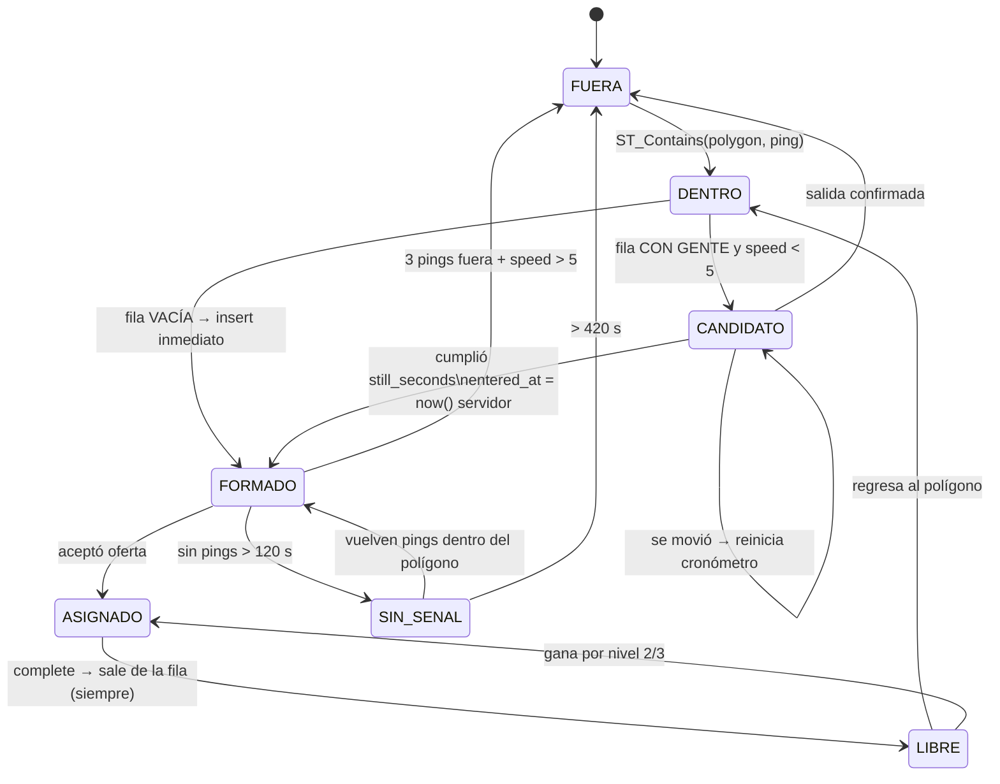
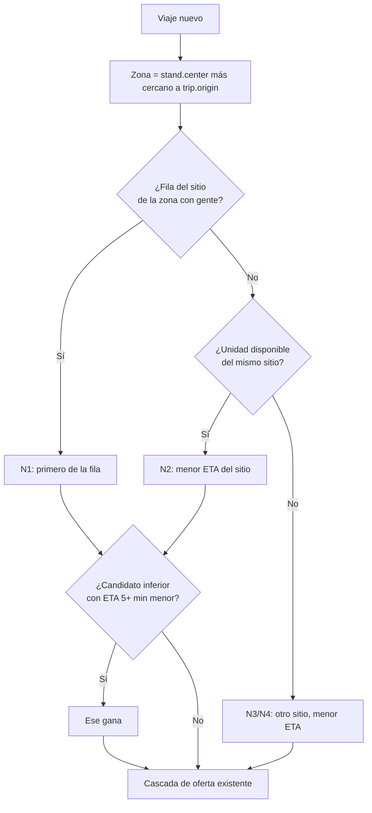

# Especificación v2: Sitios y Fila de Espera
**Repo:** `taxi-fleet-backend` (FastAPI + PostgreSQL/PostGIS/TimescaleDB + Redis)
**App chofer:** React Native (Expo — usa `push_token` de Expo)
**Escrita después de revisar el código real del repo.** Se apega a las convenciones existentes.

---

## 0. Aviso de nomenclatura (leer antes de codificar)

⚠️ **La palabra "turno" ya está ocupada en este repo.** `vehicle_assignments` es el turno de trabajo (qué chofer trae qué unidad). Para no romper el vocabulario del código:

| Concepto | Término en código |
|---|---|
| Jornada chofer↔unidad | **turno / assignment** (ya existe) |
| Lugar en la fila del sitio | **fila / queue / posición** (nuevo) |

Tablas nuevas en inglés como el resto (`vehicles`, `drivers`, `trips`, `location_pings`), docstrings en español.

---

## 1. Lo que YA existe y no hay que rehacer

| Pieza | Dónde | Nota |
|---|---|---|
| Botón "ocupado" del chofer | `POST /vehicles/{id}/status` | Ya valida que sea su unidad del turno abierto |
| Corte de calle completo | `POST /trips/street-hail` | Nace `en_curso`, pone unidad en `ocupado` |
| Buffer offline (lado backend) | `POST /location/ping` con `LocationBatchIn` | Hasta 100 pings/lote, dedup por `uq_ping_vehicle_time` |
| Motor de despacho en cascada | `app/core/dispatch.py` | Ofrece por cercanía, 25 s de timeout, push + WS |
| Oferta/rechazo | `Trip.offered_driver_id`, `offer_expires_at`, `/accept`, `/reject` | |
| Telemetría con PostGIS + TimescaleDB | `location_pings` (hypertable) | `GEOGRAPHY(POINT,4326)` con GiST |
| Push a app cerrada | `app/core/push.py` | Expo push token en `drivers.push_token` |
| WebSocket flota y chofer | `/ws/fleet`, `/ws/driver` | |
| Estados de unidad | `VehicleStatus`: disponible / ocupado / offline / mantenimiento | |

**Lo único realmente nuevo es: sitios, fila, y reordenar los candidatos del despacho.**

---

## 2. Conflicto crítico a resolver: hora del dispositivo vs. hora del servidor

`LocationPing.timestamp` es **la hora del GPS del teléfono** (decisión correcta y documentada: al vaciar el buffer offline los pings deben ordenarse por su hora real de captura). `received_at` guarda la llegada.

Pero **la posición en la fila no puede depender de la hora del teléfono** — cualquiera cambia el reloj y se brinca a los demás.

### Reglas

1. `stand_queue.entered_at` = **`now()` del servidor** en el momento en que el motor de estados confirma el ingreso. Nunca `ping.timestamp`.
2. **Un ping atrasado no puede formar a nadie.** Solo se evalúan para fila los pings donde:
   ```
   received_at - timestamp <= QUEUE_PING_MAX_LAG_SECONDS  (default 90)
   ```
   Los pings más viejos se guardan para el historial de rutas, pero **no mueven la máquina de estados**. Sin esta regla, un chofer que sale del sitio, se va 20 minutos sin señal y vuelve a conectar, dispararía transiciones de fila con datos de hace 20 minutos.
3. Si `|timestamp − received_at|` es negativo o excede `CLOCK_DRIFT_MAX_SECONDS` (60), registrar evento sospechoso.

---

## 3. Bug encontrado en el código actual (arreglar antes de lo demás)

En `app/api/location.py`, `ingest_pings`:

```python
ordered = sorted(payload.pings, key=lambda p: p.timestamp)
accepted = await _persist_pings(db, vehicle.id, ordered)
await _broadcast_latest(vehicle.id, ordered[-1])   # ← aquí
```

`_broadcast_latest` sobreescribe la última posición en cache **sin comparar contra lo que ya estaba**. Cuando la app vacía un buffer viejo (justo el caso para el que existe el lote), el mapa de la operadora retrocede a una posición de hace minutos, y el motor de despacho ve esa posición como "actual".

**Fix:** leer `get_last_position(vehicle_id)` y solo difundir/guardar si `ordered[-1].timestamp` es más reciente que el cacheado.

Con fila de por medio esto deja de ser cosmético: una posición vieja puede sacar a alguien del polígono.

---

## 4. Modelo de datos nuevo

### `stands` (sitios)
```python
class Stand(Base):
    __tablename__ = "stands"
    id: UUID (pk, default uuid4)
    name: str(100)
    polygon: Geography("POLYGON", 4326, spatial_index=True)   # trazado con ~15 m de holgura
    center: Geography("POINT", 4326, spatial_index=True)      # para "sitio más cercano"
    still_seconds: int = 45          # cronómetro de detención
    max_speed_kmh: float = 5.0
    active: bool = True
    created_at: datetime
```

### `vehicles` — columna nueva
```python
stand_id: Mapped[uuid.UUID | None] = mapped_column(
    UUID(as_uuid=True), ForeignKey("stands.id"), index=True
)
```

**Va en `vehicles`, no en `drivers`.** En este proyecto la unidad es la que pertenece al sitio (la telemetría, el despacho y las placas son por unidad; el chofer rota vía `vehicle_assignments`). Si un chofer cambia de unidad, cambia de sitio con ella — que es como funciona en la realidad.

### `stand_queue` (la fila)
```python
class StandQueue(Base):
    __tablename__ = "stand_queue"
    id: UUID (pk)
    stand_id: FK stands (index)
    vehicle_id: FK vehicles (index)
    driver_id: FK drivers (index)      # tomado del assignment abierto al momento de formarse
    entered_at: datetime               # HORA DEL SERVIDOR — define el orden
    status: StandQueueStatus           # formado / asignado / salio
    position_held: bool = False        # RESERVADA, NO ACTIVA — ver sección 8
    left_at: datetime | None
    left_reason: str | None
```

**Índice único parcial** — una unidad no puede estar en dos filas:
```sql
CREATE UNIQUE INDEX uq_queue_vehicle_active
  ON stand_queue (vehicle_id) WHERE status = 'formado';
```

**La posición NO se guarda como número.** Se calcula:
```sql
ROW_NUMBER() OVER (PARTITION BY stand_id ORDER BY position_held DESC, entered_at)
```
(`position_held DESC` quedó de la compensación retirada — hoy nada pone esa
columna en `True`, así que el orden lo define `entered_at` a secas. Ver sección 8.)

### `stand_queue_events` (bitácora)
`id`, `vehicle_id`, `driver_id`, `stand_id`, `event`, `detail` (JSONB), `created_at`

Eventos: `entered_polygon`, `still_confirmed`, `joined_queue`, `exit_confirmed`, `signal_lost`, `dropped_no_signal`, `offered_trip`, `left_after_trip`, `operator_override`.

(`position_held` era un evento de la compensación retirada; ya no se emite. Lo
sustituye `left_after_trip`, con `detail = {"zona_propia": bool}`.)

Esto es lo que resuelve las discusiones: el turno es dinero y hace falta poder abrir el registro.

### Enum nuevo (en `app/models/enums.py`, valores en español como los demás)
```python
class StandQueueStatus(str, enum.Enum):
    FORMADO = "formado"
    ASIGNADO = "asignado"
    SALIO = "salio"
```

### ❌ NO agregar un campo `estado` al chofer
`VehicleStatus` ya existe y funciona. El estado de fila es **derivado**: pertenecer a `stand_queue` con `status='formado'`. Duplicarlo crea dos fuentes de verdad que se van a desincronizar.

Estado efectivo = `VehicleStatus` (disponible/ocupado/offline/mantenimiento) **+** presencia en `stand_queue`.

---

## 5. Configuración nueva (`app/config.py`)

```python
# --- Sitios y fila de espera ---
STAND_STILL_SECONDS_DEFAULT: int = 45        # fallback si el sitio no lo define
STAND_MAX_SPEED_KMH: float = 5.0
STAND_EXIT_CONSECUTIVE_PINGS: int = 3        # lecturas fuera para confirmar salida
STAND_POLYGON_BUFFER_METERS: int = 15        # holgura al trazar
QUEUE_PING_MAX_LAG_SECONDS: int = 90         # ping más viejo que esto no mueve la fila
CLOCK_DRIFT_MAX_SECONDS: int = 60
QUEUE_SIGNAL_WARN_SECONDS: int = 120         # avisar a operadora
QUEUE_SIGNAL_DROP_SECONDS: int = 420         # sacar de la fila
GPS_MAX_ACCURACY_METERS: float = 50.0        # peor precisión aceptada
GPS_MAX_JUMP_KMH: float = 200.0              # descartar teletransporte
DISPATCH_TIER_ADVANTAGE_SECONDS: int = 300   # ventaja mínima para saltar la fila (5 min)
DISPATCH_POST_TRIP_COOLDOWN_SECONDS: int = 60
```

### Ajustes a config existente
- `DISPATCH_SEARCH_RADIUS_METERS = 5000` → **queda corto** para 30–40 km de cobertura. Subir a `15000` o hacerlo escalonado (buscar a 5 km, si no hay candidatos ampliar).
- `DISPATCH_POSITION_FRESHNESS_SECONDS = 300` vs `QUEUE_SIGNAL_DROP_SECONDS = 420`: **alinearlos**. Si no, hay una ventana de 2 min donde alguien sigue en la fila pero el despacho ya no lo considera candidato — la fila avanza sin razón visible.

---

## 6. Validación de pings (nueva capa antes de la máquina de estados)

En orden. Los pings que fallan 1–3 se **guardan igual** para historial pero se marcan y no evalúan fila.

1. `accuracy > GPS_MAX_ACCURACY_METERS` → no evalúa fila (no cuenta como latido perdido).
2. Salto respecto al ping anterior de esa unidad > `GPS_MAX_JUMP_KMH` → descartar.
3. `speed == 0 AND accuracy == 0` repetido → posible GPS falso → evento + alerta a operadora.
4. Lag `received_at − timestamp > QUEUE_PING_MAX_LAG_SECONDS` → no evalúa fila (sección 2).
5. Pasó todo → aplica máquina de estados.

---

## 7. Máquina de estados de fila

### Sub-estados (derivados, no persistidos salvo `formado`)

| Sub-estado | Entra cuando | Sale a |
|---|---|---|
| `FUERA` | — | `DENTRO` al pisar el polígono |
| `DENTRO` | `ST_Contains(stand.polygon, ping.location)` | ver bifurcación ↓ |
| `CANDIDATO` | Detenido, cronómetro corriendo | `FORMADO` al cumplir / `DENTRO` si se mueve |
| `FORMADO` | Fila sellada (fila `stand_queue`) | `ASIGNADO` o `SALIO` |

### Bifurcación clave

> **Elegibilidad y posición en fila son cosas distintas.** El cronómetro solo existe para resolver disputas de orden. Si no hay con quién disputar, no aplica.

- **Fila del sitio vacía** → al entrar al polígono, `INSERT` inmediato en `stand_queue`, sin cronómetro. Ya es asignable.
- **Fila con gente** → `CANDIDATO`: requiere `speed < max_speed_kmh` **y** dentro del polígono. Si se mueve por encima del umbral, **el cronómetro se reinicia**. Al cumplir `still_seconds` → `INSERT` con `entered_at = now()`.

Precondición en ambos casos: `VehicleStatus == disponible` y existe `vehicle_assignments` abierto.

### Salida confirmada (sin período de gracia)

El que se va, se va — pero no con una sola lectura, porque el GPS brinca 30–50 m con el carro quieto.

> **Salida confirmada = `STAND_EXIT_CONSECUTIVE_PINGS` (3) lecturas seguidas fuera del polígono Y `speed > max_speed_kmh` en al menos una de ellas.**

Con muestreo de 3 s son ~9 s: instantáneo para el chofer, sin falsos positivos por deriva.
→ `status = 'salio'`, `left_reason = 'exit_confirmed'`.

### Sin señal
- Sin pings > `QUEUE_SIGNAL_WARN_SECONDS` (120) → evento `signal_lost`, **conserva su lugar**, aviso al dashboard para que la operadora llame por radio.
- Sin pings > `QUEUE_SIGNAL_DROP_SECONDS` (420) → `status='salio'`, `left_reason='dropped_no_signal'`.
- Si vuelven los pings y sigue dentro del polígono → sigue con su `entered_at` original.

### Dónde corre el motor
Dos disparadores:
1. **Por evento**, dentro de `ingest_pings` (o en un `asyncio.create_task` que no bloquee el camino caliente — son 10–20 escrituras/seg).
2. **Barrido periódico** cada 30 s para lo que no depende de pings: expirar cronómetros y detectar pérdida de señal (nadie manda ping avisando que dejó de mandar pings).

---

## 8. Asignación: reordenar candidatos, no reescribir el motor

El punto de inserción es **`find_candidate_drivers()` en `app/core/dispatch.py`**. Todo lo demás (cascada, oferta, timeout, push, accept/reject) se queda igual.

Hoy ordena por distancia pura:
```python
rows = sorted(result.mappings().all(), key=lambda r: r["distance_m"])
```

### Nueva lógica

**Zona del viaje** = el `stand` cuyo `center` está más cerca de `trip.origin`.
(Arrancar así. Solo si en la práctica hay repartos injustos entre dos sitios pegados, agregar polígonos de zona dibujados en el dashboard.)

**Escalones de prioridad** para un viaje en la zona del Sitio A:

| Nivel | Candidato |
|---|---|
| 1 | Primero de la fila del Sitio A |
| 2 | Unidad `disponible` del Sitio A rodando (no en fila), menor ETA |
| 3 | Unidad `disponible` de otro sitio, menor ETA |
| 4 | Primero de la fila de otro sitio, menor ETA |

Dentro de cada nivel, ordenar por ETA. Entre niveles:

> Un candidato de nivel inferior gana **solo si su ETA es al menos `DISPATCH_TIER_ADVANTAGE_SECONDS` (5 min) menor** que el mejor del nivel superior.

**Por qué el umbral y no "siempre el más cercano":** si el más cercano siempre gana, los choferes aprenden que rondar cerca de otros sitios paga más que formarse, y en semanas nadie se forma. Diferencia chica → gana la fila (protege el sistema). Diferencia grande → gana el cliente.

**Nunca entra en la comparación** una unidad `formado` en su propio sitio cuando el viaje es de otra zona, salvo nivel 4 (nadie más disponible). Se respeta la fila ajena.

### ETA, no línea recta
`ST_Distance` es distancia geodésica. En Guaymas un canal, un cerro o la vía del tren hacen que el de 500 m tarde más que el de 2 km.

Arranque pragmático: **distancia / velocidad promedio urbana (25 km/h)** como proxy de ETA. Es suficiente para comparar candidatos y no agrega dependencias. Si después se quiere precisión real, un OSRM propio (gratis, self-hosted) da ETA por calle sin costo por consulta.

### Compensación — ~~imprescindible~~ RETIRADA (9 de agosto de 2026)

> **Esta sección ya no describe el comportamiento del sistema.** Se conserva
> para entender por qué la columna `position_held` existe.

La regla original decía: si el motor asigna a una unidad un viaje de **otra**
zona estando ella en la fila de la suya, al cerrar el viaje se reinserta con
`position_held = True` y su `entered_at` original, porque si no los choferes
rechazan esos viajes.

**Regla vigente: al completar un viaje se sale de la fila, siempre.** Da igual
si el viaje era de su zona o de otra. La unidad se vuelve a formar sola cuando
**regresa físicamente** al polígono, al final de la fila, como cualquier otra.

Se retiró por dos razones, las dos medidas en `scripts/sim_tiempo_real.py`
(jornada de 1000 viajes, 80 unidades, 10 h):

1. **Reinsertaba a la unidad estando lejísimos del sitio** — se midieron hasta
   **9.6 km**. Como `position_held` ordena primero, quedaba de cabeza de fila y
   por tanto candidata del escalón 1 para viajes que no podía atender: el
   pasajero esperaba a alguien que venía del otro lado del municipio.
2. **Decisión de la operación**: un turno que acaba de completar un viaje —y de
   cobrarlo— no conserva el primer lugar frente a los que llevan formados
   esperando. Cubre el que sigue en la fila.

La preocupación original (que rechacen los viajes de otra zona) sigue siendo
válida y habrá que vigilarla en operación real; si reaparece, el remedio ya no
es el lugar conservado sino algo que no le quite el turno a nadie más.

**`position_held` queda como columna reservada, no activa**: nada la pone en
`True`. Se conservan la columna, el `ORDER BY` y `reorder_queue` apagándola,
para que revertir esta decisión sea volver a escribirla en
`handle_vehicle_freed`. El evento `position_held` de la bitácora tampoco se
emite ya; en su lugar se registra `left_after_trip` con
`detail = {"zona_propia": bool}`.

### Post-viaje
`POST /trips/{id}/complete` ya pone la unidad en `disponible`. No hace falta un estado nuevo ni que el chofer declare intención:
- Maneja de regreso y entra al polígono → la máquina de estados lo forma sola.
- Sale viaje en la zona con fila vacía mientras regresa → se lo lleva (nivel 2).
- Fila con gente → el viaje es del formado, él sigue su camino.

`DISPATCH_POST_TRIP_COOLDOWN_SECONDS = 60` (no 300): si acaba de entregar y sale un corte a dos cuadras con fila vacía, se quiere que lo tome.

---

## 9. Endpoints nuevos

```
POST   /stands                          (staff)  alta con polígono GeoJSON
GET    /stands                          (staff)
PATCH  /stands/{id}                     (staff)  editar polígono/parámetros
GET    /stands/{id}/queue               (staff + chofer)  fila en tiempo real
POST   /stands/{id}/queue/reorder       (staff)  override manual → SIEMPRE a bitácora
DELETE /stands/{id}/queue/{vehicle_id}  (staff)  sacar a alguien → bitácora
GET    /vehicles/{id}/queue-position     (chofer) su lugar actual
```

**Polígono desde GeoJSON:**
```sql
ST_Buffer(ST_GeomFromGeoJSON(:geojson)::geography, :buffer_m)
```
El mismo endpoint sirve a leaflet-draw (dashboard) y al marcado por toques en la app.

**Broadcast de la fila:** reusar el pub/sub que ya existe (`app/core/redis_client.py`), canal nuevo `stand:queue`, consumido por `/ws/fleet` y `/ws/driver`. **La fila visible en tiempo real para todos los choferes elimina la mayoría de las discusiones sobre el orden.**

---

## 10. Lado app (React Native / Expo)

### Foreground Service — bloqueador actual
Hoy la app solo transmite en primer plano. Eso **rompe la fila**: el chofer bloquea el celular y el backend lo interpreta como salida.

- `expo-location` con `startLocationUpdatesAsync` + `expo-task-manager` (`TaskManager.defineTask`).
- `foregroundService: { notificationTitle: "Turno activo", notificationBody: "Enviando ubicación" }`.
- **Arrancar SOLO desde el botón "Iniciar turno" con la app abierta** → no se requiere `ACCESS_BACKGROUND_LOCATION` ni el video de justificación en Play Console (causa común de rechazo).
- Manifest: `FOREGROUND_SERVICE`, `FOREGROUND_SERVICE_LOCATION`, `ACCESS_FINE_LOCATION`.
- Pedir exención de optimización de batería. Pantalla de ayuda por marca (MIUI, Samsung, Oppo, Huawei matan servicios aunque Android no debiera).

### Buffer local
El backend ya acepta lotes de 100 y deduplica. Falta el lado app: SQLite (o `expo-sqlite`) → guardar → enviar → borrar al recibir 202. Tope 500 puntos, descartar los más viejos.

**GPS ≠ señal de datos.** El GPS funciona sin internet; lo que se cae es el envío. Son dos problemas distintos y hacen falta las dos soluciones.

### Cadencia adaptativa
- Fuera de sitio: 15 s
- Dentro del círculo circunscrito a algún polígono: 3 s (para medir la detención)

Android nativo **solo soporta geocercos circulares**. Combinar: círculo circunscrito como geocerco nativo (barato en batería, despierta la app) + polígono validado en backend (la verdad oficial).

### UI nueva
- Tarjeta "Estás en fila en Sitio X — lugar 3 de 7", en vivo por WS
- Lista completa de la fila (transparencia)
- Toggle "formarme automáticamente" (si no, notificación con un toque para confirmar)

---

## 11. Diagramas

### Ciclo de fila



### Selección de candidatos



---

## 12. Orden de implementación

1. **Fix del broadcast retroactivo** (sección 3) — pequeño y bloquea todo lo demás.
2. Capa de validación de pings (sección 6) + columnas de marcado.
3. Migración Alembic: `stands`, `stand_queue`, `stand_queue_events`, `vehicles.stand_id`, enum `stand_queue_status`.
   Convención del repo: `alembic/versions/AAAAMMDD_HHMM_descripcion.py`.
4. Motor de fila (`app/core/stands.py`) + barrido periódico. **Tests con pings sintéticos antes de tocar la app** — el repo ya tiene `tests/factories.py` y `test_dispatch.py` como modelo.
5. Escalones de prioridad en `find_candidate_drivers()` + tests.
6. Endpoints de sitios y fila + broadcast por WS.
7. Dashboard: leaflet-draw para trazar polígonos + panel de fila en vivo + override con bitácora.
8. App: Foreground Service, buffer SQLite, cadencia adaptativa, UI de fila.
9. Prueba de jornada completa en el celular de un chofer real, con su marca y su uso normal.
10. Distribución por **internal testing** de Play Console (hasta 100 dispositivos, sin revisión).

---

## 13. Pendientes de seguridad detectados de paso

- **Rotar el `TWILIO_AUTH_TOKEN`**: el archivo `.env` con credenciales reales salió del equipo dentro del comprimido. Está bien ignorado en `.gitignore`, pero ese token ya debe considerarse comprometido.
- `POST /location/ping` se autentica con `device_key_hash` y no tiene rate limit. Con la fila de por medio, un `device_key` filtrado permitiría a alguien inyectar posiciones falsas y formarse sin estar en el sitio. Vale un límite por unidad (Redis, igual que `login_throttle.py`).
- `CORS_ORIGINS = "*"` en `.env`: cerrar al dominio real antes de producción.
